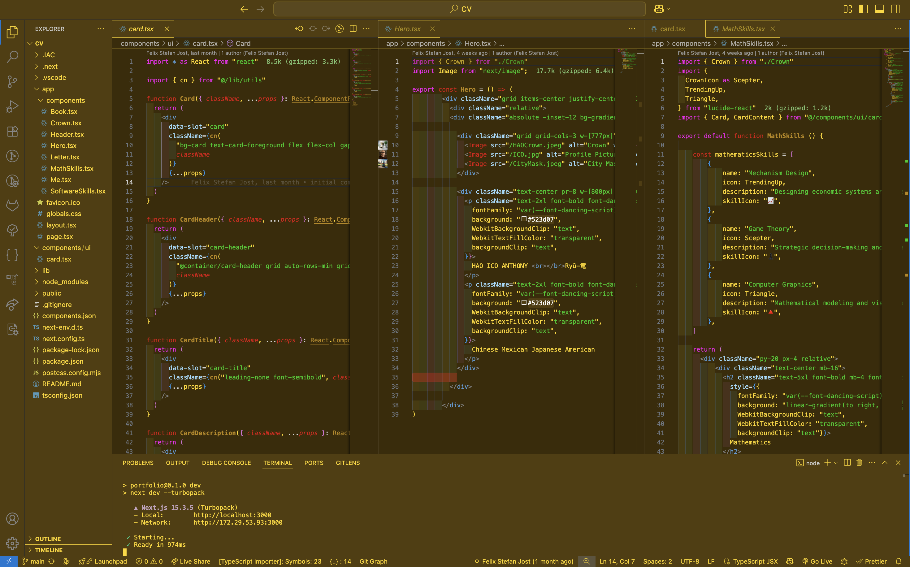

# TechStackSetup

## Overview

First tings First, get your VSCode-Editor[https://code.visualstudio.com/download] already and use my Color-Scheme:

- Cntrl + Shift + P
- Choose Preferences: Open User Settings (JSON)
- Copy & Paste my settings.json from this Repository

<!-- markdownlint-disable MD033 -->
 
<!-- markdownlint-enable MD033 -->

Let me give you a little Introduction to my Tech-Stack and to 'what is used for WHAT'?

- Terraform: IAC (Infrastructure as Code)
  - With Terraform you can define all the Cloud-Ressources as Code and ship it with 1 Click into the whole WORLD!
  - Servers, Serverless-Computations, Databases, LLM's, User-Interfaces, ...

<!-- markdownlint-disable MD033 -->

  

  

  

  

  

 
<!-- markdownlint-enable MD033 -->

- Python: AI (Artificial Intelligence)
  - Everything AI - related can be done the best with Python, let it be your own Model, or Chains

<!-- markdownlint-disable MD033 -->

  <!-- LangChain Logo -->
  

  <!-- Hugging Face Badge -->
  

 
<!-- markdownlint-enable MD033 -->

- Nuxt: All about User-Interfaces
  - I have been a NextJS-Maxi myself for a long time(3 years) and loved it, however there are 2 main Issues:
    1. They implemented so many new Features in such a short Time, that the Hydration-Errors already appear and disappear out of nowhere for no reason
    2. The Terraform AWS-Configurations and Issues to correct are waaay harder than for Nuxt
  - So at this Point I am Vibing heavily with Nuxt and can recommend it to everybody

<!-- markdownlint-disable MD033 -->

  <!-- LangChain Logo -->
  

  <!-- Hugging Face Badge -->
  

 
<!-- markdownlint-enable MD033 -->

- Typescript: All about Documents
  - Typescript has the best Libraries and Packages to create all kinds of Documents, in all Formats and Styles.

<!-- markdownlint-disable MD033 -->

  <!-- LangChain Logo -->
  

  <!-- Hugging Face Badge -->
  

 
<!-- markdownlint-enable MD033 -->

- Golang: Backends and hard Computations
  - Golang is my opinion the best Coding-Language for Backends
    1. Garbage-Collector, makes Coding Faster and Safer + Focus more on the things you want to implement
    2. Parallelism, with Golang you can parallelize just everything, my Code is always lightning fast
    3. Code-Structure, Golang is exceptional Clean in Code if you do it right
    4. Amazing Packages, for everything you need there exist a package, DO NOT REINVENT THE WHEEL
    5. Fast and Easy Cross-OP-Builds

<!-- markdownlint-disable MD033 -->

  <!-- LangChain Logo -->
  

 
<!-- markdownlint-enable MD033 -->

## Installation

To Setup all the mentioned Technologies on your MacBook, follow those Instructions

## Dependencies

<!-- markdownlint-disable MD034 -->
- /bin/bash -c "$(curl -fsSL https://raw.githubusercontent.com/Homebrew/install/HEAD/install.sh)"
<!-- markdownlint-enable MD034 -->
- echo 'eval "$(/opt/homebrew/bin/brew shellenv)"' >> ~/.zprofile
  eval "$(/opt/homebrew/bin/brew shellenv)"
- brew --version
- brew install node
- node -v
- npm -v
- npm install -g typescript
- tsc -v
- npm install -g tailwindcss
- tailwindcss -v
- npm install -g nuxi
- nuxi --version
- brew install go
- go version
- brew install python
- python3 --version
- python3 --version
- brew tap hashicorp/tap
- brew install hashicorp/tap/terraform
- terraform version
- brew install git
- git --version
- brew install gh

## Setting up a Terraform Template

## Setting up a Golang-Lambda-Function

## Setting up a Typecript-Lambda-Function

## Setting up a Pythony-Lambda-Function

## Setting up a NuxtJS-Project

## Deploying Everything -> Look at MakeFile

## VSCode-Extensions

aaron-bond.better-comments
austenc.tailwind-docs
blanu.vscode-styled-jsx
bradlc.vscode-tailwindcss
christian-kohler.npm-intellisense
christian-kohler.path-intellisense
codezombiech.gitignore
davidanson.vscode-markdownlint
dbaeumer.vscode-eslint
dsznajder.es7-react-js-snippets
eamodio.gitlens
editorconfig.editorconfig
esbenp.prettier-vscode
formulahendry.auto-close-tag
formulahendry.auto-rename-tag
github.copilot
github.copilot-chat
gitlab.gitlab-workflow
golang.go
graphql.vscode-graphql
graphql.vscode-graphql-syntax
gruntfuggly.todo-tree
hbenl.vscode-test-explorer
imgildev.vscode-auto-barrel
imgildev.vscode-json-flow
imgildev.vscode-next-pack
imgildev.vscode-nextjs-generator
inci-august.august-themes
infeng.vscode-react-typescript
james-yu.latex-workshop
jasonnutter.search-node-modules
jawandarajbir.react-vscode-extension-pack
jmkrivocapich.drawfolderstructure
kisstkondoros.vscode-gutter-preview
lucono.karma-test-explorer
mariusalchimavicius.json-to-ts
mathematic.vscode-latex
mechatroner.rainbow-csv
mhutchie.git-graph
mikestead.dotenv
ms-vscode.makefile-tools
ms-vscode.test-adapter-converter
ms-vscode.vscode-typescript-next
ms-vsliveshare.vsliveshare
msjsdiag.vscode-react-native
mushan.vscode-paste-image
naumovs.color-highlight
oderwat.indent-rainbow
pmneo.tsimporter
pulkitgangwar.nextjs-snippets
ritwickdey.liveserver
shardulm94.trailing-spaces
shd101wyy.markdown-preview-enhanced
steoates.autoimport
stringham.move-ts
styled-components.vscode-styled-components
usernamehw.errorlens
vincaslt.highlight-matching-tag
vivaxy.vscode-conventional-commits
vue.volar
willluke.nextjs
wix.vscode-import-cost
woongbaera.nextjs-pathfinder
xabikos.javascriptsnippets
xabikos.reactsnippets
yoavbls.pretty-ts-errors
yzhang.markdown-all-in-one
zarifprogrammer.tailwind-snippets
